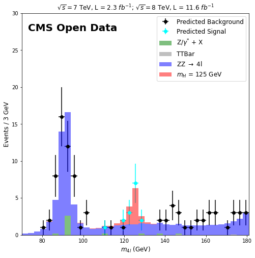

# xgboost-cmsopendata-higgs

Supervised machine learning model for event selection in H -> ZZ -> 4l using CMS Open Data.

# CMS Open Data samples

For producing Monte Carlo's samples used for training an [XGBoost](https://xgboost.readthedocs.io/en/latest/index.html) model for each leptonic channel, we forked and modified the example analysis Higgs-to-four-lepton using 2011-2012 data from [here](http://opendata.cern.ch/record/5500).

# Predictions

  

